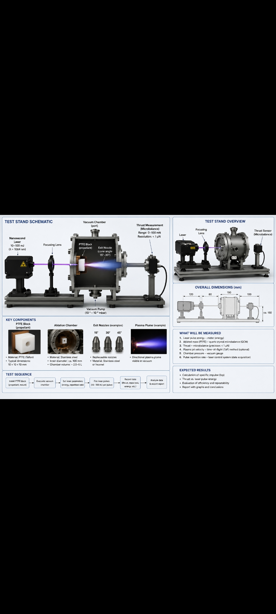

# Design

## Test Stand Overview

The experimental test stand consists of the following components:

- Nanosecond laser (10–100 mJ, 1064 nm)
- Beam focusing optics
- Vacuum chamber (10⁻⁵–10⁻⁶ mbar)
- PTFE target (propellant)
- Exchangeable conical nozzle (15°, 30°, 45°)
- Thrust measurement system (microbalance)
- Vacuum pump
- Data acquisition system

## Test Stand Schematic

## Design Objectives

- Simple and low-cost construction
- Reliable thrust measurements
- Repeatable experimental conditions
- Easy replacement of PTFE targets
- Modular design for future upgrades

Concept Design

The image included in this repository illustrates the conceptual design of the proposed nanosecond laser ablation propulsion system using PTFE as a solid propellant.

Main Components

- Nanosecond pulsed laser
- Beam focusing optics
- PTFE target
- Target feed mechanism
- Nozzle
- Plasma plume

Operating Principle

The laser pulse is focused onto the PTFE target. The laser energy vaporizes and ionizes a small amount of material, producing a plasma plume. The momentum of the expanding plasma generates thrust according to the conservation of momentum.

Purpose

The illustration is intended to communicate the overall system concept. It is not a final engineering drawing. Component dimensions, materials, and geometry will be refined during the experimental phase of the project.

Figure

See the concept image included in this repository.
